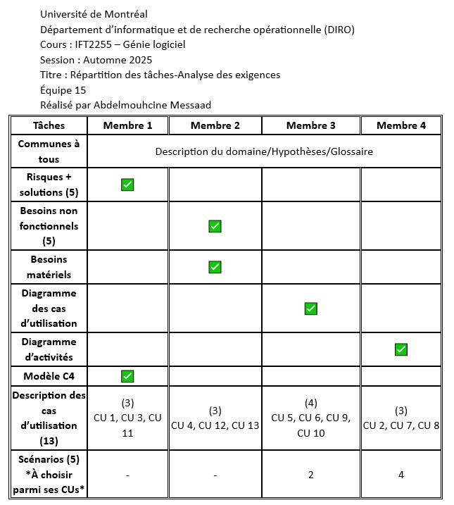

Plateforme d’aide à la planification de parcours pour étudiaants

## Équipe

- **`M1`:** Ring Thomas (20162157) #papi_speedrun
- **`M2`:** Bencheikh El Atmani Ayoub (20237691) #yubito04
- **`M3`:** Messaad Abdelmouhcine (20287581) #abdel_kb99 
- **`M4`:** Ujineza Ursuline (20272011) #boredGenie

## Description du projet

## Échéancier

| Tâches                                        | Terminé le   | Statut    | Responsable         |
| --------------------------------------------- | ------------ | --------- | ------------------- |
| Réunion d’équipe / Répartition des tâches     | 30 septembre | ✅ Terminé | `M1` `M2` `M3` `M4` |
| Description du domaine, hypothèses, glossaire | 2 octobre    | ✅ Terminé | `M1` `M2` `M3` `M4` |
| Évaluation des risques + solutions            | 4 octobre    | ✅ Terminé | `M1`                |
| Besoins non fonctionnels et matériels         | 5 octobre    | ✅ Terminé | `M2`                |
| Diagramme des cas d’utilisation               | 6 octobre    | ✅ Terminé | `M3`                |
| Diagramme d’activités                         | 6 octobre    | ✅ Terminé | `M4`                |
| Descriptions des cas d’utilisation (CU)       | 8 octobre    | ✅ Terminé | `M1` `M2` `M3` `M4` |
| Scénarios liés aux CU                         | 9 octobre    | ✅ Terminé | `M2` `M3` `M4`      |
| Modèle C4                                     | 9 octobre    | ✅ Terminé | `M1`                |
| Relecture et mise en page finale              | 10 octobre   | ✅ Terminé | `M1` `M2` `M3` `M4` |

## Répartition des tâches
